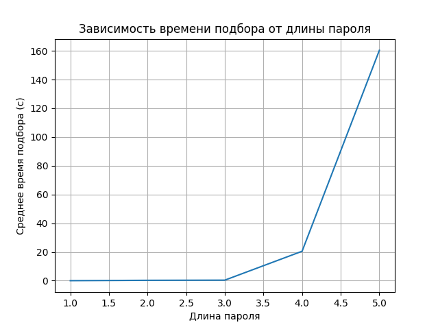

# Программа для перебора паролей

### Как работает программа

Программа извлекает список паролей длиной от 1 до 5 символов, состоящих из цифр, из файла passwords.txt.
Если файла passwords.txt нет, то программа генерирует пароли самостоятельно.
С помощью библиотеки request программа отправляет GET запросы в php-форму.
В случае совпадения пароля с паролем из базы данной программа открывает полученную web-страницу в браузере.
Так же программа записывает длинну пароля и время подбора в файл time.txt.
С помощью скрипта graph.py и библиотеки matplotlib можно построить график зависимости времени подбора от длины пароля.

### Как использовать программу

Для запуска API необходимо наличие python, а также библиотеки request, math, webbrowser и time. Предпочтительная версия python v3.6

```
$ python3.6 Brutforce.py
```

Для построения графика необходимы библиотеки matplotlib и re.

```
$ python3.6 graph.py

```

### Эффективность простого подбора паролей

На графике мы можем видеть, что среднее время подбора паролей резко возрастает при увеличении длины пароля с 4 до 5 символов.
Отсюда следует, что данный метод подбора пароля является не очень эфективным.


